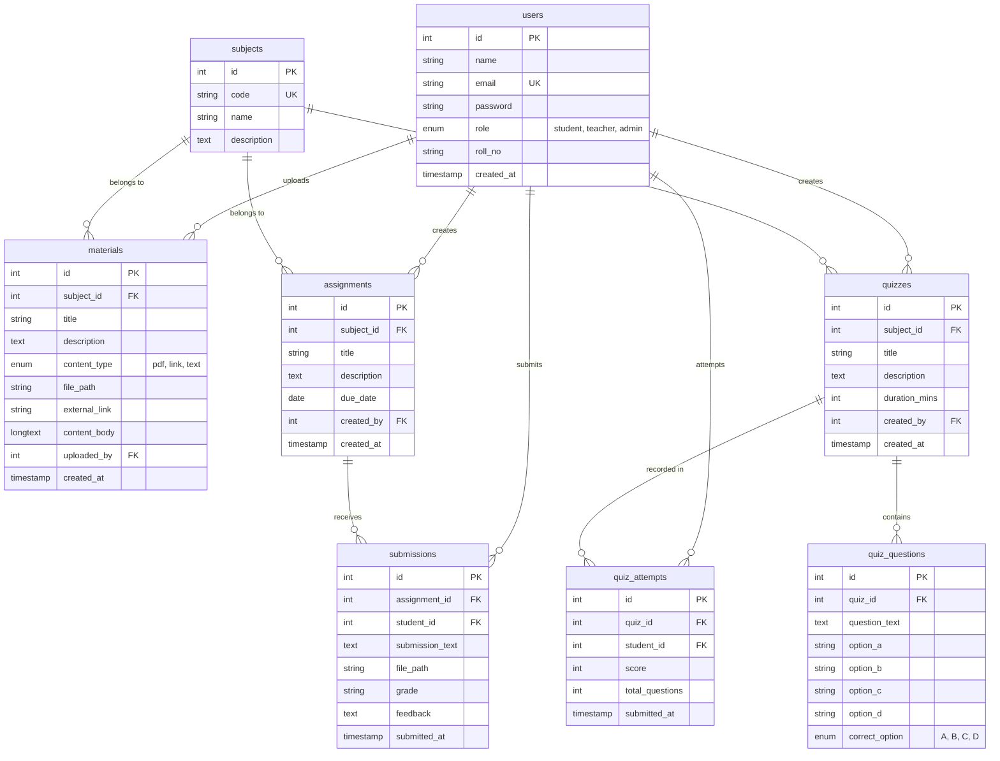

# Technical Architecture & System Specification
## Grade 10 E-Learning Management System

---

## 1. System Overview & Technology Stack

The **Grade 10 E-Learning Management System** is built as a lightweight, high-performance, monolithic web application using standard procedural and object-oriented PHP and MySQL. It intentionally operates without heavy third-party framework overhead (like Laravel or Symfony) to guarantee instant page render speeds, minimal hosting resource consumption, and zero external runtime dependencies.

### Core Technology Stack
- **Language / Server Runtime**: PHP 7.4+ / 8.x
- **Database Engine**: MySQL 5.7+ / 8.0+ or MariaDB 10.3+ (`InnoDB` engine, `utf8mb4_unicode_ci` collation)
- **Data Access Layer**: PHP Data Objects (`PDO`) with strict prepared statement execution
- **Frontend / Styling**: Vanilla HTML5, CSS3 with custom CSS Variables design system, native SVG icons
- **Authentication**: Native PHP session engine (`session_start()`) with double-namespace isolation
- **Security Standard**: Bcrypt hashing (`PASSWORD_DEFAULT`), CSRF anti-forgery tokens, `htmlspecialchars()` XSS escaping

---

## 2. Directory Architecture & Module Isolation

The codebase is organized into two execution modules: **Main Learning Portal** (`/`) and **Administration Control Module** (`/admin/`).

```
grade10-elearning/
├── config/
│   └── db.php                  # Primary DB connection & BASE_URL auto-resolution
├── includes/
│   ├── auth_check.php          # Session guard, CSRF helpers, role authorization
│   ├── header.php              # Shared portal header navigation
│   └── footer.php              # Shared portal footer markup
├── uploads/                    # Physical storage for assignment & material file attachments
├── admin/                      # Isolated Admin Module
│   ├── config/
│   │   └── db.php              # Admin proxy to root DB config
│   ├── includes/
│   │   ├── auth_check.php      # Admin session authorization guard
│   │   ├── header.php          # Admin layout header
│   │   └── footer.php          # Admin layout footer
│   ├── index.php               # Admin Dashboard (Analytics & Metrics)
│   ├── course.php              # Subject/Course CRUD Interface
│   ├── users.php               # Account Management CRUD Interface
│   ├── login.php               # Admin Portal Login
│   └── logout.php              # Admin Session Termination
├── index.php                   # Portal Home Page & Subject List
├── login.php                   # Student / Teacher Login Endpoint
├── register.php                # Student Self-Registration Endpoint
├── logout.php                  # Portal Session Termination
├── student_dashboard.php       # Student Academic Workspace
├── teacher_dashboard.php       # Teacher Management Workspace
├── subject_detail.php          # Subject-level Hub (Notes, Homework, Quizzes)
├── manage_materials.php        # Teacher Material Upload & Management Engine
├── manage_assignments.php      # Teacher Assignment Creation & Grading Engine
├── submit_assignment.php       # Student Assignment Submission Handler
├── manage_quizzes.php          # Teacher Quiz Builder & MCQ Management Engine
├── take_quiz.php               # Student Quiz Execution Engine
├── quiz_result.php             # Student Quiz Score Verification
├── setup_database.php          # Automated DB Bootstrapper & Seed Generator
├── schema.sql                  # Canonical SQL Schema definition
├── DESIGN.md                   # Visual design specification
├── PRODUCT.md                  # Product roadmap & capabilities document
└── DOCUMENTATION.md            # Non-technical end-user & admin documentation
```

### Path Resolution Engine (`config/db.php`)
The system dynamically calculates `BASE_URL` at runtime by inspecting `$_SERVER['SCRIPT_NAME']`. This eliminates hardcoded domain paths and allows the application to execute seamlessly under any directory nesting depth (e.g., `http://localhost/grade10-elearning/` or `http://school.edu.np/`):

```php
if (!defined('BASE_URL')) {
    $dir = str_replace('\\', '/', dirname($_SERVER['SCRIPT_NAME'] ?? '/'));
    if (basename($dir) === 'admin') {
        $dir = dirname($dir);
    }
    define('BASE_URL', rtrim($dir, '/') . '/');
}
```

---

## 3. Database Architecture & Schema Deep-Dive

### Entity-Relationship Diagram (ERD)



### Table Definitions & Technical Constraints

1. **`users` Table**:
   - `id`: `INT AUTO_INCREMENT PRIMARY KEY`
   - `email`: `VARCHAR(100) UNIQUE NOT NULL` (Used for user authentication)
   - `password`: `VARCHAR(255) NOT NULL` (Bcrypt hashed string)
   - `role`: `ENUM('student', 'teacher', 'admin') DEFAULT 'student'`
   - `roll_no`: `VARCHAR(20) DEFAULT NULL` (Student identifier, e.g., `10-01`)

2. **`subjects` Table**:
   - `id`: `INT AUTO_INCREMENT PRIMARY KEY`
   - `code`: `VARCHAR(20) UNIQUE NOT NULL` (Curriculum code, e.g., `MATH10`, `SCI10`)
   - `name`: `VARCHAR(100) NOT NULL`

3. **`materials` Table**:
   - Stores polymorphic content: `text` (body in `content_body`), `link` (URL in `external_link`), or `pdf` (path in `file_path`).
   - Foreign keys: `subject_id` &rarr; `subjects(id)` (`ON DELETE CASCADE`), `uploaded_by` &rarr; `users(id)` (`ON DELETE CASCADE`).

4. **`assignments` & `submissions` Tables**:
   - Unique constraint: `UNIQUE KEY uniq_assignment_student (assignment_id, student_id)` enforces a **strict one-submission per student rule**. Re-submitting updates the existing row rather than duplicating entries.

5. **`quizzes`, `quiz_questions`, `quiz_attempts` Tables**:
   - `quizzes.duration_mins`: Integer value defining maximum allowed time limit.
   - `quiz_questions.correct_option`: `ENUM('A','B','C','D')` stores correct key for auto-grading.
   - `quiz_attempts`: Log of past test executions per student.

---

## 4. Authentication, Session & Access Control Layer

### Dual Namespace Session Architecture
To eliminate authorization bypass risks across modules, the application maintains two isolated session namespaces within the standard PHP session context:

| Module | Login Endpoint | Session Variables Key Set | Authorized Roles |
| :--- | :--- | :--- | :--- |
| **Portal** (`/`) | `/login.php` | `$_SESSION['user_id']`<br>`$_SESSION['user_name']`<br>`$_SESSION['user_email']`<br>`$_SESSION['user_role']` | `student`, `teacher` |
| **Admin** (`/admin`) | `/admin/login.php` | `$_SESSION['admin_id']`<br>`$_SESSION['admin_name']`<br>`$_SESSION['admin_email']` | `admin` |

*Security Guarantee*: An active session in `$_SESSION['user_id']` grants zero access to administrative endpoints (`/admin/*`) because administrative guards check exclusively for `$_SESSION['admin_id']` via `require_admin()`.

### Access Guard Functions (`includes/auth_check.php`)

```php
function require_login(): void {
    if (!is_logged_in()) {
        header("Location: " . BASE_URL . "login.php?msg=" . urlencode("Please log in to access this page."));
        exit;
    }
}

function require_role($roles): void {
    require_login();
    if (!in_array(user_role(), (array)$roles, true)) {
        header("Location: " . BASE_URL . "index.php?error=" . urlencode("Access denied."));
        exit;
    }
}

function require_admin(): void {
    if (!admin_is_logged_in()) {
        header("Location: " . BASE_URL . "admin/login.php");
        exit;
    }
}
```

---

## 5. Security Architecture & Threat Vector Countermeasures

### 1. SQL Injection (SQLi) Defense
- **Implementation**: PDO with strict parameter binding (`PDO::PREPARE`).
- **Configuration Guard**: `PDO::ATTR_EMULATE_PREPARES => false` forces native prepared statements on the MySQL server, rendering SQL concatenation attacks impossible.

### 2. Cross-Site Scripting (XSS) Mitigation
- **Implementation**: Contextual HTML escaping on all rendered dynamic output using `htmlspecialchars($var, ENT_QUOTES, 'UTF-8')`.
- Applied across headers, submission bodies, user lists, and form values.

### 3. Cross-Site Request Forgery (CSRF) Countermeasure
- **Token Generation**: Cryptographically secure pseudo-random token using `bin2hex(random_bytes(32))`.
- **Validation**: Timed constant comparison via `hash_equals($_SESSION['csrf_token'], $_POST['csrf_token'])`.
- Required on all state-mutating requests (`POST`/`PUT`/`DELETE` actions).

```php
function csrf_verify(): void {
    $sent = $_POST['csrf_token'] ?? '';
    if (!is_string($sent) || !hash_equals($_SESSION['csrf_token'] ?? '', $sent)) {
        http_response_code(400);
        exit('Invalid or expired form token. Please reload the page and try again.');
    }
}
```

### 4. File Upload Sanitization & Security
- **Upload Path Isolation**: Files stored outside public code directories under `uploads/`.
- **Filename Sanitization**: Sanitized using pattern filtering (`preg_replace('/[^a-zA-Z0-9_\.-]/', '_', filename)`) and prepended with `time() . '_' . uniqid()` to prevent file collision and directory traversal exploits (`../../`).

---

## 6. Detailed Subsystem Implementation Specs

### A. Quiz Auto-Scoring Engine (`take_quiz.php`)
When a student submits a quiz:
1. The engine fetches all questions associated with `quiz_id` from `quiz_questions`.
2. Iterates over submitted answers `$_POST['answers'][$question_id]`.
3. Matches submitted option against `correct_option`.
4. Calculates score:
   $$\text{Score} = \sum_{i=1}^{N} \mathbb{I}(\text{Answer}_i = \text{CorrectOption}_i)$$
5. Records the resulting score, total count, and timestamp into `quiz_attempts`.

### B. Assignment Grading State Machine (`manage_assignments.php`)
Submissions follow a strict state flow:
- `Unsubmitted`: No record in `submissions` table.
- `Submitted / Pending`: Row exists in `submissions` with `grade = 'Pending'`.
- `Graded`: Teacher posts evaluation payload (`grade`, `feedback`), updating `grade` column from `Pending` to assigned mark/letter.

---

## 7. Database Initialization & Exception Interception

When the application boots via `config/db.php`, PDO exception codes are monitored:
- **Error Code 1049 (Unknown Database)**: Triggers an automatic redirect to `setup_database.php?error=db_missing`.
- **Database Bootstrapper (`setup_database.php`)**:
  - Connects to MySQL server root without database selection (`defined('DB_CREDENTIALS_ONLY')`).
  - Executes `CREATE DATABASE IF NOT EXISTS elearning_db`.
  - Executes DDL table creation scripts and inserts seed users/subjects.

---

## 8. Deployment & Environmental Checklist

1. **PHP Runtime**: Minimum PHP 7.4 with extensions `pdo_mysql`, `mbstring`, `session`.
2. **File Permissions**:
   ```bash
   chmod 755 uploads/
   ```
3. **Environment Overrides** (Optional via OS or `.htaccess` / `fastcgi_param`):
   - `DB_HOST`: Hostname (default: `localhost`)
   - `DB_NAME`: Database Name (default: `elearning_db`)
   - `DB_USER`: Database User (default: `root`)
   - `DB_PASS`: Database Password (default: `""`)

---
*Grade 10 E-Learning System &mdash; Core Engineering Specification*
